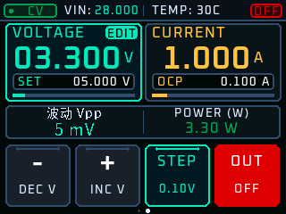

# XIN Power

基于 **PY32F403 + SC8701** 的数控可调电源，面向当前 **V2补丁硬件**。

**3.2～32V · 0.1～8A过流设定 · 16点DAC校准 · 触摸屏 · 有线/蓝牙上位机**

最新控制版本为 **6.2.3**。本次开源打包修订标记为 **6.2.3-open.1**：设备协议/版本保持6.2.3，公开副本改用思源黑体生成的OFL字库，保留原交付包，二进制校验值与原6.2.3不同。



## 从这里开始

| 想做什么 | 入口 |
|---|---|
| 阅读完整开发文章 | [立创开源文章](docs/立创开源文章.md) |
| 查看当前硬件改动 | [V2补丁说明](hardware/README.md) |
| 编译、首次安装、升级 | [构建与下载](docs/构建与下载.md) |
| 做电压校准 | [校准与使用](docs/校准与使用.md) |
| 阅读开发顺序 | [开发历程](docs/开发历程.md) |
| 下载历史关键源码 | [历史版本索引](history/README.md) |
| 查看实际保护判据 | [当前固件说明](firmware/current/README_下载与校准.md) |
| 理解最新PI | [PI控制说明](firmware/current/docs/PI控制说明.md) |
| 实现自己的上位机 | [协议5](firmware/current/docs/WIRE_PROTOCOL_5.md) |
| 查看公开包验证结果 | [发布验证](docs/发布验证.md) |

## 当前完整工程

```text
firmware/current/
  01_Bootloader/     独立Bootloader（沿用5.9.3留存基准）
  02_Application/    当前APP、HAL/CMSIS、字库及生成工具
  03_Factory/        Bootloader与APP合并HEX脚本
  04_Recovery/       当前恢复路径说明
  05_PC_Tool/        Python/PySide6上位机、打包脚本、当前测试
  docs/             PI、协议、有线断链分析
  tests/            固件主机回归、界面渲染、RAM/栈预算
downloads/          开源构建APP/Bootloader/Factory、Windows上位机
hardware/           修改前V2原理图、补丁说明、外壳文件
history/            按版本排序的关键源码快照及校验信息
docs/               开源文章、开发历程、使用与编译说明
```

历史快照是本次整理后形成的归档，没有伪造原开发日期或把试验版统一称为实测稳定版。

## 硬件与功能边界

- R274=100kΩ；R314+R315=7.62kΩ；R316+R317=5.11kΩ；R292=1.8kΩ。
- 输出理想二极管MOS **D/S短接旁路**，软件按此状态适配。输出没有这一层防倒灌/隔离，关闭使能不等于物理断开端子。
- 8A是过流设定上限，软件不做恒流输出。输入过流阈值4.8A；没有完成32V/8A连续功率验证。
- INA读取目标500Hz，屏幕50Hz，常规回传默认25Hz；实际采样间隔需实测。
- “低频波动Vpp”是最近1秒采样极差，需要示波器另测高频纹波。
- 6.2.3仅在误差±100mV内PI微调；初始参数未完成实板带载整定。6.2.2历史节点可用于纯DAC控制对照。
- 原理图PDF为修改前参考，仓库尚未包含经过此次补丁更新的可编辑PCB/BOM/生产文件。

## 来源与许可

原电源方案参考立创开源作者 **cyxsnbb666** 的[Type-C可调电源项目](https://oshwhub.com/cyxsnbb666/typec-adjustable-power-supply-wi)。XIN Power由 **LDO75** 维护。

沿用本仓库现有 [GPLv3许可证](LICENSE)。第三方器件库及字体保留独立许可，详见 [THIRD_PARTY_NOTICES](THIRD_PARTY_NOTICES.md)。

## 反馈

报告问题时请注明：硬件阻值/输出级状态、固件与上位机版本、输入电源、设定和负载、万用表/示波器结果，以及故障现场。校准点和DAC读数对复现低压问题尤其有用。发布日志前请去除个人目录、设备标识或其他无关信息。
